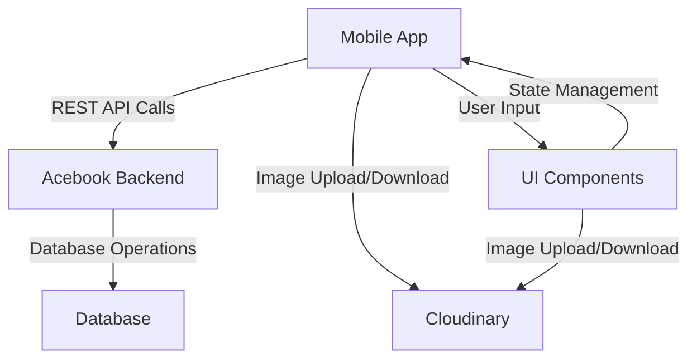
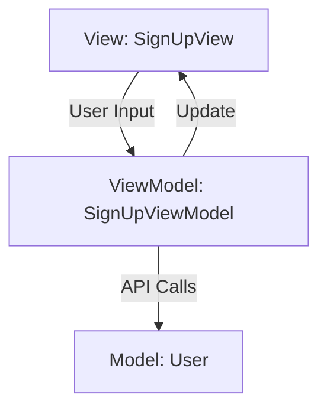
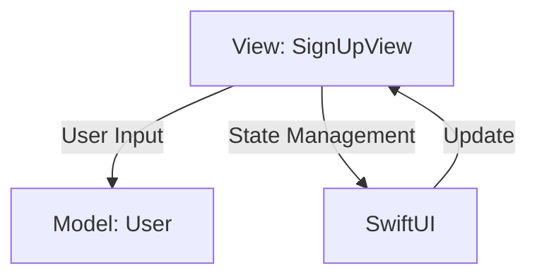

# SwiftUI Project

We created a new SwiftUI app that integrates with
[this Acebook backend](https://github.com/makersacademy/Mobile-Acebook-backend).

## Key Features 

- Developed multi-view SwiftUI applications.
- Integrated a SwiftUI app with an existing backend using RESTful APIs.
- Implemented advanced SwiftUI components like List views, sheets, Alerts and even
  custom `structs` to enhance the user interface.
- Managed complex states using SwiftUI annotations such as @State and @Binding
  (for data binding and state management).
- Write tests in Xcode that mock network calls to ensure robustness in the
  frontend / backend integration.

## Prerequisites to run the code:

These are the prerequisites you need to be aware of in order to work through
this module:

1. You must have Xcode installed on your machine.

## High-level architecture

In this architecture:
- The Mobile App communicates with the Acebook Backend through REST API calls.
- From the Mobile App, we can then upload or download images to/from Cloudinary.
- The Acebook Backend performs database operations.
- UI Components in the Mobile App take user input and manage it through state
  management within the app itself.

### MVC without the C vs MVVM

**MVVM**: In MVVM, the ViewModel acts as a mediator that handles the logic for
   the View.

This could be an example diagram to include the Sign Up functionality in our app
using MVVM:

**MVC without the C**: In this pattern, the Model and View are the primary
   actors. SwiftUI takes on the role of the Controller, managing state and
   handling user interactions.

And this one uses MVC without the C:

### Sketch mockups

